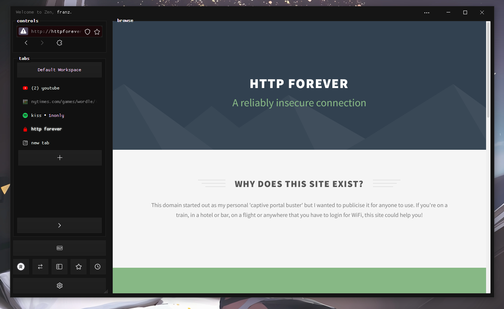
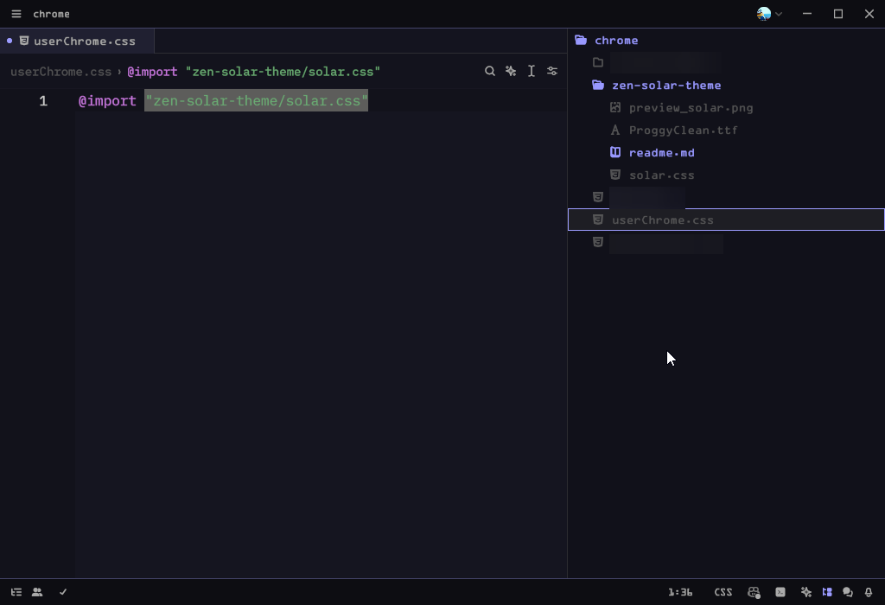

# Solar theme for Zen
This project is a **⚠ work in progress ⚠** complete reskin of the Zen browser (there is an installation guide and a preview below).
Reskin has a lot of tweaks including but not limited to:
* titlebar on sidebar
* sophisticated dark mode
* clean & simple ui design

## Preview


## Quick setup for Solar
To use Solar, follow [the official documentation](https://docs.zen-browser.app/guides/live-editing) to set up Zen's `chrome` folder and `userChrome.css` stylesheet.
After that clone or download the repository in the `chrome` folder and add this line to your `chrome\userChrome.css`
```css
@import "zen-solar-theme/solar.css"
```

After everything your `chrome` folder should look something like this


## Todo
- [ ] hideable sidebar
- [ ] fullscreen support including sleek ui tweaks
- [ ] bookmarks bar
- [ ] finished controls ui

## Reporting
Please report bugs & suggestions in github or directly dm me on discord @98u24339jioerf89u0j34noj (id 394545840766844929)
